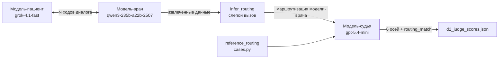
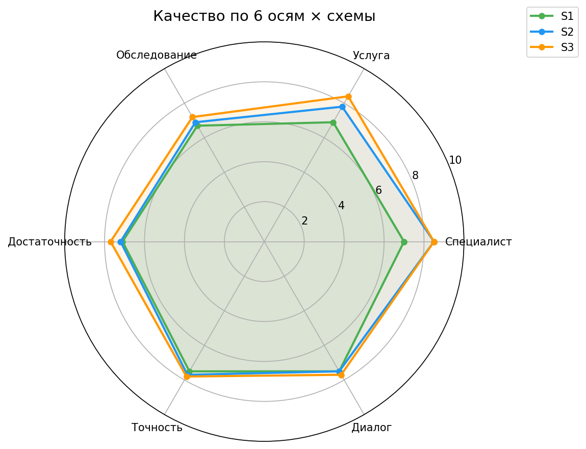
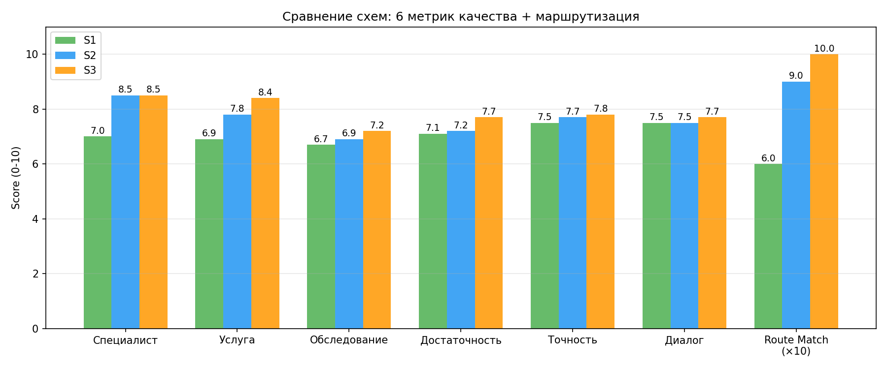
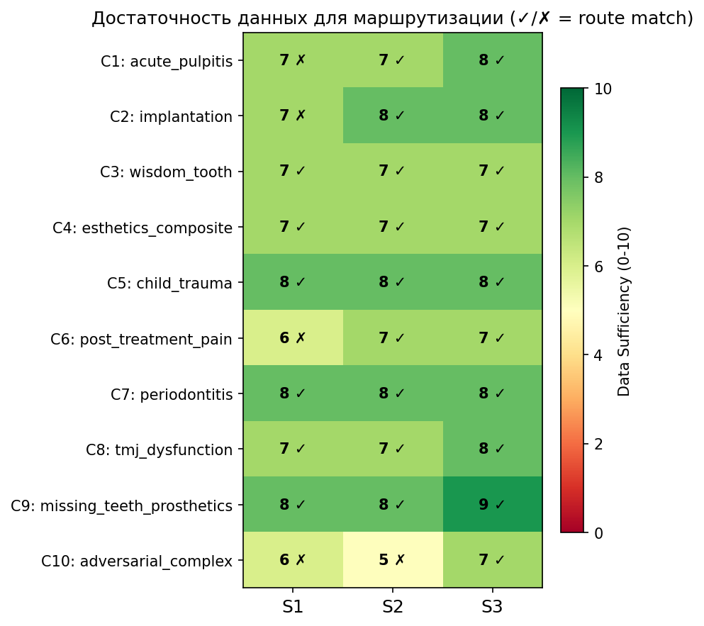
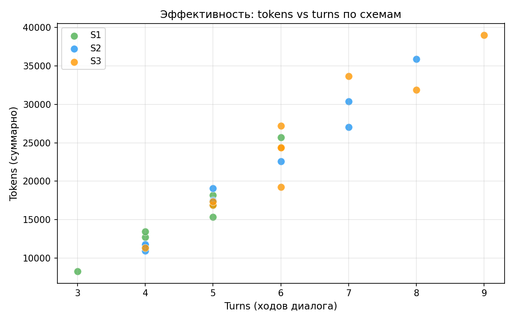

# Эксперимент Д2: Исследование влияния степени структурированности схемы извлечения анамнеза на качество клинической маршрутизации стоматологического пациента

| Параметр | Значение |
|----------|----------|
| **Шифр эксперимента** | Д2 |
| **Дата проведения** | 20 марта 2026 г. |
| **Стартап** | Медицинский AI-агент для стоматологических клиник (med-agent) |
| **Привязка к минимально жизнеспособному продукту** | Подсистема первичного онлайн-сбора анамнеза в составе агента `agent-llm` |
| **Каталог эксперимента** | `study/d2/` |
| **Финальный отчёт (авто)** | `study/d2/results/reports/d2_summary.md` |
| **Сырые данные** | `study/d2/results/dialogs/case_*.json` (10 файлов) |
| **Оценки судьи** | `study/d2/results/reports/d2_judge_scores.json` |

---

## 1. Объект и предмет исследования

**Объектом исследования** является процесс автоматизированного сбора первичного стоматологического анамнеза с последующей маршрутизацией пациента к профильному специалисту, реализованный посредством взаимодействия больших языковых моделей в формате чат-диалога.

**Предметом исследования** выступает зависимость качества определения целевого специалиста, типа услуги и необходимого обследования от степени структурированности схемы извлечения данных, используемой моделью-врачом при проведении диалога с пациентом.

---

## 2. Проблематика

Внедрение больших языковых моделей в медицинскую практику сопряжено с рядом существенных ограничений, которые особенно остро проявляются при решении задач клинической маршрутизации.

**Проблема неуправляемости извлечения.** При свободном диалоге языковая модель склонна либо избыточно расспрашивать пациента, затягивая сбор анамнеза, либо, напротив, пропускать клинически значимые факты, необходимые для определения профильного специалиста. Отсутствие формализованной схемы извлечения приводит к непредсказуемости результата — одна и та же модель при различных запусках может собрать принципиально различный объём данных.

**Проблема оценки достаточности.** В отличие от задач классического извлечения именованных сущностей, в клиническом контексте не существует единственно верного набора «обязательных» полей. Достаточность собранных данных определяется не полнотой покрытия всего анамнеза, а возможностью на их основе принять обоснованное решение о направлении пациента к конкретному специалисту. Это требует разработки специализированных метрик оценки, ориентированных на маршрутизацию, а не на информационную полноту.

**Проблема валидации без экспертов.** Привлечение врачей-экспертов для оценки каждого диалога экономически нецелесообразно на этапе прототипирования. Вместе с тем автоматические метрики (полнота, семантическое сходство) не способны оценить клиническую адекватность маршрутизации. Настоящий эксперимент использует независимую модель-эксперта, выступающую в роли клинического рецензента. В литературе этот подход обычно описывается как оценивание генеративных моделей другой языковой моделью.

---

## 3. Теоретический анализ

### 3.1. Подходы к структурированному извлечению из медицинских диалогов

Существующие подходы к сбору медицинского анамнеза в чат-системах можно разделить на три класса по степени структурированности схемы извлечения:

1. **Жёстко детерминированные опросники** — гарантируют покрытие фиксированного набора полей, но плохо адаптируются к специфике обращения. Такой подход характерен для классических систем симптомного опроса и деревьев решений. Недостаток: снижение качества при атипичных или комплексных обращениях.
2. **Извлечение с заданной схемой** — модели задаётся строгая схема данных, а выход модели валидируется программно. Такой подход соответствует современным механизмам структурированного вывода и вызова инструментов. Недостаток: модель не может выйти за пределы схемы, даже когда клинический контекст этого требует.
3. **Свободное извлечение с последующей нормализацией** — модель свободно ведёт диалог и сама формирует набор клинически значимых полей. Близкие идеи используются в исследованиях диагностического диалога, включая системы на основе самообучения в симулированной среде. Недостаток: высокая вариативность и усложнение контроля качества.

Промежуточный — **адаптивный** — подход (S2 в настоящем эксперименте) представляет практический интерес для продукта: он сохраняет обязательный каркас сбора анамнеза, но допускает расширение набора полей под тип обращения. В рамках данного проекта именно эта промежуточная схема сравнивается с двумя крайними вариантами: фиксированным и свободным извлечением.

### 3.2. Оценивание другой языковой моделью как метод валидации

Использование независимой языковой модели для оценки выхода другой модели было исследовано в работах Zheng et al. (2023) и Liu et al. (2023) на задачах открытой генерации и диалоговой оценки. Применительно к клиническому контексту такой подход требует дополнительных мер контроля:

- эталонной разметки для каждого кейса;
- разделения функций оценщика и исполнителя (разные модели разных провайдеров);
- многоосевой структуры оценки вместо бинарного решения;
- программной валидации формата выхода судьи.

В настоящем эксперименте все четыре требования соблюдены: эталонная маршрутизация задана в `cases.py`, исполнитель использует Qwen-3 235B (Alibaba), судья — gpt-5.4-mini (OpenAI), оценка многоосевая (6 числовых осей), JSON-выход судьи валидируется в `judge.py:_parse_judge_response`.

### 3.3. Существующие ограничения подходов

| Подход | Что не позволяет | Как преодолевается в эксперименте |
|--------|------------------|-----------------------------------|
| Семантическое сходство текстов по векторам | Не учитывает клиническую синонимию («гнатолог» ≈ «ортопед по ВНЧС») | Использована модель-судья, которая явно проинструктирована в `prompts/judge.md` учитывать синонимию |
| Бинарная оценка | Скрывает источник ошибки маршрутизации | Введены 6 числовых осей: специалист, услуга, обследование, достаточность, точность, диалог |
| Однократный запуск судьи | Чувствителен к шуму генерации | Температура судьи зафиксирована на 0.1; при невалидном JSON выполняется повторный запрос |
| Оценка только финальной маршрутизации | Скрывает причины ошибок | Введён двухэтапный контур: извлечение данных → слепой вывод маршрута → экспертная оценка |

### 3.4. Связь с продуктовой задачей

Маршрутизация — первый шаг любого пациентского пути в стоматологической клинике. Ошибка маршрутизации (направление не к тому специалисту) приводит к повторным визитам, недовольству пациента и потере выручки клиники. Гипотеза о том, что качество маршрутизации зависит от схемы сбора анамнеза, является ключевой для архитектуры продуктового агента и определяет выбор подхода к проектированию узла сбора анамнеза в графе обработки.

### 3.5. Методическая ценность синтетического диалогового стенда

Отдельной научно-практической ценностью эксперимента является не только сравнение трёх схем извлечения, но и сам способ получения экспериментальных данных. В Д2 был построен синтетический диалоговый стенд, в котором одна языковая модель исполняет роль пациента по заранее заданному клиническому сценарию, а другая языковая модель исполняет роль администратора/врача, последовательно собирающего анамнез. Такая постановка позволяет до выхода на реальные пациентские данные исследовать, какие вопросы задаёт агент, какие поля он заполняет, где он преждевременно завершает диалог и какие факторы безопасности пропускает.

В контексте стартапа это особенно важно по трём причинам. Во-первых, реальные медицинские диалоги сложно и долго собирать из-за требований к персональным данным и медицинской этике. Во-вторых, на ранней стадии продукта нужно быстро проверять варианты промптов, схем данных и логики маршрутизации, не привлекая врача-эксперта к каждой итерации. В-третьих, синтетический стенд позволяет воспроизводимо проверять сложные и редкие ситуации: беременность, приём антикоагулянтов, детскую травму, бисфосфонаты, множественные жалобы и противоречивые ответы пациента.

Следовательно, Д2 проверяет не только прикладную гипотезу о степени структурированности схемы, но и более широкий инженерно-научный подход: большие языковые модели могут использоваться как контролируемая симуляционная среда для ранней проверки диалоговых медицинских агентов. Этот подход не заменяет валидацию на реальных пациентах, но существенно снижает стоимость и сокращает время предварительных экспериментов, помогает выявить системные ошибки до пилота и формирует регрессионный набор для последующих версий продукта.

---

## 4. Исследовательская гипотеза

### 4.1. Формулировка

**Исследовательская гипотеза H₁:** Снижение степени структурированности схемы извлечения анамнеза с фиксированной (4 предопределённых поля) до свободной (поля определяются моделью динамически) повышает долю верных клинических маршрутизаций (`routing_match`) с уровня ≤ 60% до уровня ≥ 90% при росте суммарного расхода токенов диалога не более чем в 2 раза, в выборке из 10 клинических сценариев, охватывающих основные направления стоматологической практики.

**Нулевая гипотеза H₀:** Изменение схемы извлечения не приводит к изменению `routing_match` на ≥ 30 процентных пунктов между крайними точками шкалы структурированности при сохранении прочих условий.

### 4.2. Проверяемые количественные критерии

| Критерий | Условие поддержки H₁ | Операциональный критерий эффекта |
|----------|--------------------------|------------------------|
| Доля верных маршрутизаций | `routing_match` ≥ 9/10 для свободной схемы (S3) | Дельта `routing_match`(S3) − `routing_match`(S1) ≥ 3/10 |
| Стоимость по токенам | средние токены S3 ≤ 2 × средние токены S1 | — |
| Качество маршрутизации | `specialist_score`(S3) ≥ 8.0 (среднее по 10 кейсам) | — |
| Достаточность данных | `data_sufficiency`(S3) ≥ 7.0 | — |

### 4.3. Стратегическое значение для проекта

Выполнение критериев H₁ обосновывает отказ от минимального фиксированного опросника как единственного механизма сбора анамнеза. Для продуктовой архитектуры это означает необходимость обязательного каркаса полей и адаптивного расширения под тип обращения. Если бы критерии не были выполнены, усложнение схемы извлечения не имело бы достаточного экспериментального основания. Промежуточный результат, при котором адаптивная схема S2 показывает близкое к S3 качество при меньших расходах, обосновывает гибридную архитектуру.

---

## 5. Методика проверки гипотезы

### 5.1. Архитектура эксперимента

Эксперимент построен по принципу «модель против модели»: одна языковая модель исполняет роль врача-стоматолога, собирающего анамнез, другая — роль пациента, отвечающего на вопросы на основе заданного клинического сценария. Третья, независимая модель выступает экспертом-оценщиком.

С точки зрения формирования данных это означает, что каждый клинический сценарий задаёт скрытое состояние пациента: полную ситуацию, факторы риска и эталонную маршрутизацию. Модель-пациент не выдаёт всю информацию сразу, а раскрывает её только в ответ на конкретные вопросы. Поэтому качество итоговой анкеты зависит не только от способности модели-врача извлекать факты из текста, но и от способности вести целевой расспрос. Такая схема ближе к реальному первичному чату, чем одношаговое извлечение из готового описания случая.



| Роль | Модель | Провайдер | Назначение |
|------|--------|-----------|------------|
| Модель-врач | qwen/qwen3-235b-a22b-2507 | OpenRouter | Сбор анамнеза, извлечение данных, определение маршрутизации |
| Модель-пациент | x-ai/grok-4.1-fast | OpenRouter | Имитация поведения пациента по заданному сценарию |
| Модель-эксперт | openai/gpt-5.4-mini | OpenRouter | Независимая оценка качества маршрутизации |

Использование моделей разных провайдеров для исполнителя и судьи снижает риск смещения в пользу собственного семейства моделей, но не устраняет его полностью.

### 5.2. Сравниваемые схемы извлечения

В рамках эксперимента сравниваются три схемы, различающиеся степенью структурированности (определены в `schemas.py`):

**Схема S1 — фиксированная** (`S1Extraction`): модель извлекает строго 4 предопределённых поля — `symptoms`, `localization`, `duration`, `chronic_or_allergies`. Имитирует минимальный стандартизованный опросник первичного обращения.

**Схема S2 — адаптивная** (`S2Extraction`): помимо базовых 4 полей, модель получает 6 опциональных полей, заполняемых по релевантности — `intensity`, `triggers`, `onset`, `previous_treatment`, `desired_outcome`, `medications` — плюс служебное поле `complaint_type` для типизации обращения. Моделирует опросник с ветвлением.

**Схема S3 — свободная** (`S3Extraction`): модель самостоятельно определяет набор извлекаемых полей через `dict[str, str]`, дополнительно возвращает `confidence` и `missing_info`. Проверяет гипотезу о способности языковой модели автономно формировать структуру анамнеза.

### 5.3. Двухэтапная процедура оценки маршрутизации

После завершения диалога проводится двухэтапная процедура (реализована в `session.py:run_case_schema` + `doctor.py:infer_routing`):

1. **Вывод маршрутизации (`infer_routing`).** Модель-врач получает на вход только извлечённые из диалога данные (`extracted` JSON) — без доступа к полному описанию ситуации (`Case.situation`). На основе только этого входа Qwen определяет: целевого специалиста (`specialists`), тип услуги (`service_type`), необходимые обследования (`examination`). Результат сохраняется в `SchemaRun.routing`. Этот шаг моделирует продуктовое поведение, когда финальное решение принимается на основе собранной анкеты, а не диалога целиком.

2. **Экспертная оценка (`judge_single`).** Независимая модель-эксперт получает: полное описание ситуации пациента, эталонную маршрутизацию из `Case.reference_routing`, маршрутизацию доктора из `SchemaRun.routing`, диалог и извлечённые данные. Промпт `prompts/judge.md` инструктирует эксперта оценивать на уровне НАПРАВЛЕНИЯ К СПЕЦИАЛИСТУ, а не на уровне конкретной тактики лечения, с явным учётом клинической синонимии.

### 5.4. Формирование JSON-схем как экспериментальная переменная

Ключевое вмешательство в эксперименте — изменение JSON-схемы, через которую модель-врач обязана структурировать собранный анамнез. Поэтому схема данных рассматривается не как техническая деталь реализации, а как независимая переменная исследования. В фиксированной схеме S1 модель ограничена четырьмя полями. В адаптивной схеме S2 сохраняется обязательный каркас и добавляются опциональные клинические уточнения. В свободной схеме S3 модель получает возможность самостоятельно формировать словарь фактов.

Такое сравнение позволяет оценить, как формат структурированного выхода влияет на сам процесс расспроса. Если схема слишком узкая, модель может не задать вопросы, необходимые для сложной маршрутизации. Если схема слишком свободная, модель собирает больше данных, но расходует больше ходов и токенов. Практическая ценность эксперимента состоит в том, что он показывает: проектирование JSON-схемы является частью клинической логики агента, а не только способом сериализации результата.

### 5.5. Система метрик

| Метрика | Тип | Источник | Описание |
|---------|-----|----------|----------|
| `specialist_score` | целое число 0–10 | модель-судья | Совпадение рекомендованного специалиста с эталонным с учётом синонимии |
| `service_score` | целое число 0–10 | модель-судья | Совпадение направления услуги (не конкретной тактики) |
| `examination_score` | целое число 0–10 | модель-судья | Соответствие обследований с учётом контекста первичной онлайн-маршрутизации |
| `data_sufficiency` | целое число 0–10 | модель-судья | Достаточность собранных данных для обоснованного выбора специалиста |
| `accuracy` | целое число 0–10 | модель-судья | Отсутствие фактических искажений в извлечённых данных |
| `dialogue_quality` | целое число 0–10 | модель-судья | Клиническая обоснованность и логичность ведения расспроса |
| `routing_match` | логическое значение | программно | Истина, если все три оси маршрутизации (`specialist`, `service`, `examination`) ≥ `ROUTING_MATCH_THRESHOLD = 5` |
| `turns` | целое число | во время выполнения | Число пар вопрос–ответ в диалоге |
| `tokens_doctor` + `tokens_patient` | целое число | во время выполнения | Суммарное число токенов |
| `duration_s` | число | во время выполнения | Длительность одного прогона в секундах |

### 5.6. Параметры эксперимента

Все параметры зафиксированы в `config.py` для обеспечения воспроизводимости:

| Параметр | Значение | Источник |
|----------|----------|----------|
| Количество клинических сценариев | 10 | `cases.py:CASES` |
| Количество схем извлечения | 3 | `schemas.py:SCHEMAS` |
| Прогонов на сценарий | 3 (по одному на схему) | `session.py:run_case` |
| Максимальное число ходов диалога | 8 | `MAX_TURNS` |
| Максимум токенов (врач, ход) | 300 | `MAX_TOKENS_DOCTOR` |
| Максимум токенов (пациент, ход) | 80 | `MAX_TOKENS_PATIENT` |
| Максимум токенов (extraction) | 1000 | `MAX_TOKENS_EXTRACTION` |
| Максимум токенов (вывод маршрутизации) | 1000 | `MAX_TOKENS_ROUTING` |
| Максимум токенов (judge) | 2000 | `MAX_TOKENS_JUDGE` |
| Температура (врач) | 0.4 | `TEMPERATURE_DOCTOR` |
| Температура (пациент) | 0.9 | `TEMPERATURE_PATIENT` |
| Температура (routing) | 0.1 | `TEMPERATURE_ROUTING` |
| Температура (судья) | 0.1 | `TEMPERATURE_JUDGE` |
| Порог совпадения маршрута | ≥ 5 баллов по каждой из 3 routing-осей | `ROUTING_MATCH_THRESHOLD` |

Итого 30 диалогов (10 сценариев × 3 схемы) и 30 экспертных оценок.

### 5.7. Клинические сценарии

Десять сценариев разработаны для покрытия основных направлений стоматологической практики и включают «сложные» элементы (сопутствующие заболевания, аллергии, беременность, детский возраст), типичные для реального потока обращений:

| № | Тип сценария | Эталонный специалист | Ключевая клиническая сложность |
|---|-------------|---------------------|--------------------------------|
| 1 | Острый пульпит | Эндодонтист | Беременность 14 нед, аллергия на пенициллин |
| 2 | Имплантация после травмы | Хирург-имплантолог + ортопед | Варфарин, гипертония, курение |
| 3 | Перикоронит зуба мудрости | Хирург-стоматолог | Острое гнойное воспаление, тризм, температура |
| 4 | Эстетика передних зубов | Терапевт + ортопед | Тетрациклиновая окраска, диастема, скол |
| 5 | Детская травма | Детский хирург + детский терапевт | Ребёнок 7 лет, вывих постоянного зуба, астма |
| 6 | Боль после лечения каналов | Эндодонтист | Осложнение эндолечения, гастрит |
| 7 | Пародонтит | Пародонтолог | Сахарный диабет 2 типа, метформин, гипертония |
| 8 | Дисфункция ВНЧС | Гнатолог | Бруксизм, антидепрессант, профессиональный стресс |
| 9 | Протезирование при адентии | Ортопед + хирург-имплантолог | Остеопороз, бисфосфонаты, аллергия на новокаин |
| 10 | Adversarial: множественные жалобы | Терапевт + пародонтолог | Путаница сторон, недоверие, отвлечения, гипертония |

Полное описание ситуаций, эталонных полей и эталонной маршрутизации — в `cases.py:CASES`.

### 5.8. Ограничения методики

Методика обладает рядом ограничений, которые необходимо учитывать при интерпретации результатов:

1. **Синтетические пациенты.** Поведение реальных пациентов в чате с медицинским ассистентом может отличаться от поведения модели-пациента (разная грамотность, эмоциональность, готовность отвечать). Эксперимент не валидирован на реальных диалогах.
2. **Один прогон на условие.** Каждое сочетание (кейс × схема) выполняется однократно. Стохастичность больших языковых моделей (даже при низкой температуре) не оценивается. Доверительные интервалы и уровни статистической значимости не вычислялись.
3. **Ограниченная выборка.** N = 10 сценариев недостаточно для статистических тестов; результаты следует трактовать как качественную, а не статистическую поддержку гипотезы. Дельта `routing_match` 6/10 → 10/10 даёт точечную оценку без доверительного интервала.
4. **Смещение модели-судьи.** Хотя судья использует другое модельное семейство и явные критерии в промпте, остаточное смещение к структурированным или развёрнутым ответам не исключено.
5. **Стационарность моделей.** Эксперимент фиксирует поведение моделей в конкретный момент времени (март 2026); провайдеры могут обновлять модели, что приведёт к расхождению при повторном запуске.
6. **Эталонная маршрутизация — экспертная.** Эталоны в `cases.py:reference_routing` сформированы автором на основе клинических протоколов, но не валидированы независимой панелью практикующих стоматологов.

---

## 6. Артефакты эксперимента

Все артефакты являются результатом личного вклада и непосредственно используются в проверке гипотезы или войдут в состав минимально жизнеспособного продукта стартапа.

| Категория | Файл | Связь с гипотезой / продуктом |
|-----------|------|--------------------------|
| Точка входа | `d2/run.py` | CLI-оркестратор, поддерживает `--cases`, `--judge`, `--report-only`, `--routing-only` |
| Конфигурация | `d2/config.py` | Все параметры эксперимента в одном месте — гарантия воспроизводимости |
| Модели данных | `d2/models.py` | `Case`, `SchemaRun`, `CaseResult` — структуры для хранения результатов |
| Схемы извлечения | `d2/schemas.py` | S1/S2/S3 — независимая переменная эксперимента |
| HTTP-клиент | `d2/client.py` | `OpenRouterClient` с трекингом токенов |
| Модель-врач | `d2/doctor.py` | `doctor_process` (диалог) + `infer_routing` (слепая маршрутизация) |
| Модель-пациент | `d2/patient.py` | `patient_speak` — генератор ответов пациента |
| Оркестрация диалога | `d2/session.py` | `run_case_schema` — одна сессия (кейс × схема) |
| Модель-судья | `d2/judge.py` | `judge_single`, `judge_all_cases` — оценка качества |
| Кейсы | `d2/cases.py` | 10 сценариев с `reference_routing` — основа эксперимента и кандидат на регрессионный набор для проверки будущих версий агента |
| Промпты | `d2/prompts/{doctor,patient,judge,routing_infer}.md` | Независимо редактируются от кода |
| Отчёты | `d2/report.py` | Генерация `d2_summary.md` + `d2_per_case.csv` |
| Визуализация | `d2/viz.py` | Генерация 4 графиков |
| Сырые диалоги | `d2/results/dialogs/case_*.json` | 10 файлов × 3 схемы = 30 прогонов, полная трассировка для аудита |
| Оценки судьи | `d2/results/reports/d2_judge_scores.json` | Числовые оценки по 6 осям × 30 прогонов |
| Графики | `d2/results/figures/d2_quality_radar.png`, `d2_quality_heatmap.png`, `d2_schema_comparison.png`, `d2_efficiency.png` | Визуальная сводка результатов |

**Связь с продуктом:** в продуктовом агенте med-agent узел сбора анамнеза (`apps/agent-llm/core/nodes/anamnesis.py`) уже использует обязательный каркас полей (`symptoms`, `localization`, `duration`, `chronic_or_allergies`). Эксперимент Д2 показывает, что одного фиксированного каркаса недостаточно для сложных сценариев; поэтому результаты обосновывают дальнейшее развитие узла в сторону гибридной схемы: обязательные поля плюс адаптивные уточнения под тип обращения.

---

## 7. Результаты

### 7.1. Сводная таблица

| Схема | Спец | Усл | Обсл | Дост | Точн | Диал | Маршрут | Ходы | Токены |
|-------|------|-----|------|------|------|------|---------|------|--------|
| S1 — фиксированная | 7,0 | 6,9 | 6,7 | 7,1 | 7,5 | 7,5 | **6 / 10** | 4,5 | 15 010 |
| S2 — адаптивная | 8,5 | 7,8 | 6,9 | 7,2 | 7,7 | 7,5 | **9 / 10** | 5,5 | 20 417 |
| S3 — свободная | 8,5 | 8,4 | 7,2 | 7,7 | 7,8 | 7,7 | **10 / 10** | 6,2 | 24 536 |

Источник цифр: `d2/results/reports/d2_summary.md` (агрегация из `d2_judge_scores.json`).

### 7.2. Графики



*Рисунок 1 — Сравнение трёх схем извлечения по шести осям качества. S3 доминирует или сравнивается с S2 на всех осях.*



*Рисунок 2 — Сводное сравнение трёх схем по шести осям качества и нормализованной доле верных маршрутизаций (×10).*



*Рисунок 3 — Достаточность данных для маршрутизации по 10 кейсам × 3 схемам. Метка ✓/✗ — флаг `routing_match`. S1 имеет 4 ошибки маршрутизации, S2 — одну, S3 — ни одной.*



*Рисунок 4 — Эффективность: суммарный расход токенов в зависимости от числа ходов диалога. Показывает рост стоимости при переходе к менее структурированным схемам.*

### 7.3. Проверка гипотезы

| Критерий H₁ | Условие | Фактическое значение | Результат |
|-------------|---------|---------------------|-----------|
| `routing_match`(S1) ≤ 60% | ≤ 6/10 | **6/10** | ✓ выполнено |
| `routing_match`(S3) ≥ 90% | ≥ 9/10 | **10/10** | ✓ выполнено |
| Дельта `routing_match`(S3) − `routing_match`(S1) ≥ 30 п.п. | ≥ 3/10 | **+4/10** | ✓ выполнено |
| Средние токены S3 ≤ 2 × средние токены S1 | ≤ 30 020 | **24 536** | ✓ выполнено |
| `specialist_score`(S3) ≥ 8.0 | ≥ 8.0 | **8,5** | ✓ выполнено |
| `data_sufficiency`(S3) ≥ 7.0 | ≥ 7.0 | **7,7** | ✓ выполнено |

**Все 6 заранее заданных количественных критериев H₁ выполнены.** На полученной выборке есть основания говорить о качественной поддержке исследовательской гипотезы. Статистическое отклонение H₀ не проводится, поскольку выборка мала (10 сценариев), а каждое сочетание «кейс × схема» запускалось один раз.

### 7.4. Ключевые наблюдения

**7.4.1. Зависимость точности маршрутизации от объёма контекста.** Фиксированная схема (S1) систематически допускает критические ошибки маршрутизации в сценариях, где истинная цель обращения не очевидна из первичной жалобы. В сценарии 2 (расшатавшийся протез как симптом необходимости имплантации) S1 направила пациента к терапевту для коррекции протеза вместо дентальной имплантации (`specialist_score` = 3 из 10). Адаптивная и свободная схемы в этом же сценарии верно определили хирурга-имплантолога и ортопеда (`specialist_score` = 10 и 8 соответственно). Это подтверждает: четырёх предопределённых полей недостаточно для дифференциальной маршрутизации в клинически неоднозначных ситуациях.

**7.4.2. Однозначные клинические картины нивелируют разницу между схемами.** При ярко выраженной симптоматике (острый перикоронит — кейс 3, генерализованный пародонтит — кейс 7, дисфункция ВНЧС — кейс 8) все три схемы обеспечивают верную маршрутизацию (`routing_match = True` для всех S1/S2/S3 в этих кейсах). Это указывает на важное практическое свойство: для типичных обращений, составляющих основной поток клиники, даже минимальная схема извлечения обеспечивает приемлемое качество. Преимущество свободной схемы проявляется именно на «сложных» случаях — атипичных, комплексных или с отсроченной формулировкой основной жалобы.

**7.4.3. Больше данных ≠ точнее маршрутизация.** Свободная схема (S3) в среднем извлекает в 2–3 раза больше полей, чем фиксированная (S1), однако в ряде сценариев это не приводит к повышению точности маршрутизации. В сценарии 6 (боль после лечения каналов) S3 извлекла больше полей за большее число ходов, но `specialist_score` оказался ниже, чем у S2. Критична не полнота извлечения, а фокус на клинически релевантных фактах.

**7.4.4. Устойчивые слепые зоны языковых моделей.** В ряде сценариев модель-врач не извлекает или недостаточно учитывает следующие категории данных:

- **«Молчаливые» факторы безопасности** — беременность, аллергии, приём лекарств. Модель не задаёт прямых вопросов о факторах, которые пациент не упоминает сам. Подтверждено в кейсах 1 (беременность пропущена во всех трёх схемах), 9 (бисфосфонаты пропущены).
- **Вторичные жалобы** — при множественных обращениях модель фокусируется на основной проблеме (кейс 10: отбеливание упоминается во всех схемах, но не учитывается при маршрутизации S1).
- **Возрастная дифференциация** — модель может выбрать клинически близкого взрослого специалиста вместо детского специалиста, даже когда возраст пациента указан в диалоге (кейс 5).
- **Смещение к «типичным» диагнозам** — модель склонна интерпретировать любую боль через призму пульпита или периодонтита.

Эти ограничения являются системными для текущего экспериментального контура и требуют архитектурных решений на уровне графа обработки, а не только изменения текстовых инструкций.

---

## 8. Применимость результатов в продуктивной системе

### 8.1. Гибридная схема извлечения

Полученные результаты обосновывают выбор гибридной архитектуры сбора анамнеза для продуктового агента med-agent. Оптимальным решением является комбинация подходов:

- **Обязательный каркас** (аналог S2) — фиксированный набор полей, гарантирующий извлечение жалобы, локализации, давности, аллергий, хронических заболеваний и текущих лекарств. Извлекается независимо от типа обращения, обеспечивает минимально достаточный уровень безопасности.
- **Адаптивное расширение** (элементы S3) — модель самостоятельно добавляет дополнительные поля на основе контекста, что позволяет адаптироваться к нестандартным случаям без раздувания стандартного опросника.

Эксперимент показал, что адаптивная схема обеспечивает 90% совпадений маршрута на синтетической выборке при расходе ресурсов на 17% ниже, чем свободная (20 417 против 24 536 токенов). Это делает её более рациональным кандидатом для продуктового агента, чем полностью свободная схема, но требует проверки на реальных обращениях.

### 8.2. Архитектурные решения на основе выявленных ограничений

Четыре системных ограничения, выявленных в ходе эксперимента, трансформируются в конкретные архитектурные решения для продуктового агента (узлы графа в `apps/agent-llm/core/nodes/`):

1. **Обязательные вопросы безопасности.** Независимо от хода диалога, агент должен содержать программно заданный список вопросов: беременность, аллергии, текущие лекарства, возраст. Реализуется как отдельный узел в графе обработки, выполняемый перед завершением сбора анамнеза, и не зависит от «решения» языковой модели задать или не задать соответствующий вопрос.
2. **Возрастная маршрутизация.** При выявлении педиатрического пациента (возраст < 18) маршрутизация автоматически переключается на детских специалистов через детерминированное правило в графе.
3. **Валидация множественных жалоб.** После завершения диалога запускается этап сверки: все ли предъявленные жалобы отражены в итоговой маршрутизации. При обнаружении потерянных жалоб агент возвращается к уточнению или формирует расширенный маршрут.
4. **Контроль диагностического смещения.** Промпт модели-врача содержит явное указание на необходимость рассмотрения альтернативных направлений (эстетика, протезирование, ревизия), а не только наиболее вероятного диагноза.

### 8.3. Эксперимент как регрессионный набор

Описанный эксперимент формирует **регрессионный набор для медицинского агента** — аналог модульных тестов в традиционной разработке программного обеспечения, но ориентированный на клиническое качество. При каждом обновлении промптов или смене базовой модели набор `cases.py` может запускаться повторно, а числовые метрики сравниваться с предыдущей версией. Это обеспечивает контролируемое развитие системы и снижает риск неожиданной деградации качества — критически важное свойство для медицинского программного обеспечения.

### 8.4. Ускорение экспериментального цикла

Синтетический диалоговый стенд снижает стоимость ранней проверки продуктовых решений. Вместо того чтобы для каждой версии промпта или схемы данных проводить интервью с реальными пациентами, команда может сначала прогнать контролируемый набор сценариев и увидеть, какие факты агент собирает, какие вопросы задаёт и какие маршруты предлагает. Это особенно полезно для медицинского стартапа, где реальные данные требуют правовых и этических процедур, а ошибка в логике расспроса может быть выявлена заранее на безопасной симуляции.

Метод не отменяет последующую проверку на реальных обращениях, но меняет порядок разработки: сначала дешёвый и воспроизводимый синтетический стенд, затем экспертная ревизия критичных кейсов, затем пилот на реальном потоке. Поэтому Д2 создаёт не только результат по конкретной схеме S2, но и повторяемую методику быстрого отбора решений для диалогового агента.

### 8.5. Прогнозируемый эффект

При внедрении результатов в продуктовую систему формируются следующие продуктовые гипотезы и архитектурные ожидания:

- **Снижение ошибок первичной маршрутизации.** В экспериментальной выборке адаптивная схема дала 9/10 совпадений маршрута; перенос этого уровня на реальные обращения требует отдельного пилота.
- **Стандартизация сбора анамнеза.** Устранение зависимости качества опроса от квалификации администратора клиники.
- **Сокращение времени очного приёма.** Предварительно собранный анамнез теоретически позволяет врачу сосредоточиться на осмотре и диагностике; фактическое сокращение времени приёма в Д2 не измерялось.
- **Повышение выявляемости сопутствующих потребностей.** Адаптивная схема лучше подходит для фиксации вторичных жалоб, однако этот эффект должен быть проверен на реальных диалогах.

---

## 9. Воспроизводимость

### 9.1. Окружение

- Python 3.13
- Зависимости: `httpx`, `pydantic ≥ 2.0`, `python-dotenv`, `matplotlib`, `numpy`
- Переменная окружения: `OPENROUTER_API_KEY` в файле `study/.env`
- Доступ: API-ключ OpenRouter с балансом ≥ 200 ₽

### 9.2. Команды запуска

```bash
# Из каталога study/
.venv/bin/python -m d2.run --cases all       # Полный прогон 10 кейсов × 3 схемы
.venv/bin/python -m d2.run --cases 1,3,5     # Выборочные кейсы
.venv/bin/python -m d2.run --routing-only    # Дозапуск вывода маршрутизации
.venv/bin/python -m d2.run --judge           # Оценка собранных диалогов
.venv/bin/python -m d2.run --report-only     # Регенерация отчёта и графиков
```

### 9.3. Время и оценочная стоимость

| Этап | Время | Токены | Стоимость |
|------|-------|--------|-----------|
| 30 диалогов (10 кейсов × 3 схемы) | ~50 минут | ~600 000 | ~150 ₽ |
| 30 выводов маршрутизации | ~5 минут | ~30 000 | ~10 ₽ |
| 30 экспертных оценок | ~10 минут | ~120 000 | ~40 ₽ |
| **Итого один полный цикл** | **~65 минут** | **~750 000** | **~200 ₽** |

Токены и длительность берутся из сохранённых прогонов и логики клиента. Стоимость является расчётной оценкой по тарифам используемого провайдера на момент запуска; она не сохраняется отдельным полем в артефактах эксперимента. Сравнение с врачом-экспертом также является оценочным: привлечение врача для ручной оценки 30 диалогов могло бы потребовать 5 000–15 000 ₽ и нескольких часов работы. Поэтому этот блок следует использовать как ориентир ресурсоёмкости, а не как самостоятельный экономический результат.

### 9.4. Идентификация версий моделей

Все модели используются через OpenRouter с явно указанными slug в `config.py`:
- `qwen/qwen3-235b-a22b-2507` (фиксированная версия июля 2025)
- `x-ai/grok-4.1-fast`
- `openai/gpt-5.4-mini`

При недоступности конкретной версии OpenRouter может маршрутизировать запрос на ближайший псевдоним модели — это потенциальный источник расхождения при повторной воспроизводимости.

---

## 10. Выводы

1. **Гипотеза H₁ получила качественную поддержку** на выборке из 10 синтетических клинических сценариев по всем шести заранее заданным количественным критериям. Свободная схема извлечения (S3) обеспечила `routing_match` = 10/10 при среднем `specialist_score` = 8,5 и расходе токенов 24 536 (1,6 × от S1). Дельта `routing_match` между S3 и S1 составила +4/10 (40 п.п.), что превышает заданный порог 30 п.п. Из-за размера выборки и однократных прогонов этот результат не является статистическим доказательством.

2. **Фиксированная схема S1 (4 поля) не должна использоваться как единственный механизм сбора анамнеза** в продуктовой системе: в экспериментальной выборке она дала 4 ошибки маршрутизации из 10. Для медицинского контекста такой уровень риска требует обязательных уточняющих механизмов.

3. **Адаптивная схема S2 является наиболее рациональным продуктовым кандидатом**: 9/10 совпадений маршрута при умеренном расходе (5,5 ходов, 20 417 токенов). Она уступает S3 по точечной доле совпадений маршрута, но требует меньше ресурсов и лучше подходит для контролируемого продуктового контура.

4. **Предложенный экспериментальный формат «модель-врач — модель-пациент — модель-эксперт»** масштабируем как инженерный контур регрессионной проверки. Оценочная стоимость одного полного цикла составляет около 200 ₽, однако это не результат прямого финансового эксперимента, а расчёт по токенам и тарифам провайдера.

5. **Выявлены четыре системных ограничения больших языковых моделей** при сборе анамнеза в текущем контуре: непрашивание факторов безопасности, потеря вторичных жалоб, отсутствие возрастной дифференциации, смещение к типичным диагнозам. Каждое ограничение трансформировано в конкретное архитектурное решение для узлов графа `apps/agent-llm/core/nodes/`.

6. **Продуктовый эффект Д2 состоит не в доказательстве рыночной эффективности, а в выборе архитектурного направления**: фиксированного опросника недостаточно, полностью свободная схема дороже, а адаптивная схема является наиболее рациональным кандидатом для дальнейшей реализации и пилотной проверки.

7. **Дополнительная научно-практическая ценность Д2 состоит в создании синтетического диалогового стенда**: две языковые модели, поставленные в роли пациента и врача, позволяют быстро проверять варианты схемы сбора данных, выявлять пропущенные вопросы и формировать регрессионный набор до выхода на реальные медицинские диалоги. Этот подход не заменяет клиническую валидацию, но существенно ускоряет ранний цикл экспериментов.

8. **Ограничения интерпретации результатов**: выборка N = 10 не позволяет получить статистически устойчивые доверительные интервалы; результаты следует трактовать как качественную поддержку гипотезы. Для строгой статистической валидации требуется расширение выборки, многократные прогоны и независимая экспертная проверка эталонных маршрутов.

---

## 11. Источники

1. Zheng L., Chiang W.-L., Sheng Y. et al. Оценивание языковых моделей с помощью другой языковой модели на наборах MT-Bench и Chatbot Arena. NeurIPS, 2023. URL: https://huggingface.co/papers/2306.05685
2. Liu Y., Iter D., Xu Y. et al. G-Eval: оценивание генерации через большие языковые модели и формализованную рубрику. EMNLP, 2023. URL: https://aclanthology.org/2023.emnlp-main.153/
3. Tu T., Schaekermann M., Palepu A. et al. К построению разговорного диагностического искусственного интеллекта. Nature, 2025. URL: https://www.nature.com/articles/s41586-025-08866-7
4. Всемирная организация здравоохранения. Этика и управление искусственным интеллектом в здравоохранении: руководство по большим мультимодальным моделям. 2024/2025. URL: https://www.who.int/publications/i/item/9789240084759
5. Liu X., Cruz Rivera S., Moher D. et al. Расширение CONSORT-AI для отчётности по клиническим исследованиям систем искусственного интеллекта. Nature Medicine, 2020. URL: https://www.nature.com/articles/s41591-020-1034-x
6. OpenAI. Документация по структурированному выводу и вызову инструментов. 2024–2026. URL: https://platform.openai.com/docs/guides/function-calling/function-calling-with-structured-outputs
7. Yang A. et al. Технический отчёт Qwen3. 2025. URL: https://huggingface.co/papers/2505.09388
8. Reimers N., Gurevych I. Sentence-BERT: получение векторных представлений предложений для семантического поиска. EMNLP, 2019. URL: https://aclanthology.org/D19-1410/
9. Документация Pydantic v2. Валидация моделей данных и словарных структур. URL: https://docs.pydantic.dev/
10. Документация OpenRouter. Доступ к моделям и учёт токенов через единый программный интерфейс. URL: https://openrouter.ai/docs

---

*Настоящий документ подготовлен в рамках выпускной квалификационной работы стартап-формата. Все клинические сценарии являются синтетическими и не содержат персональных данных реальных пациентов.*
